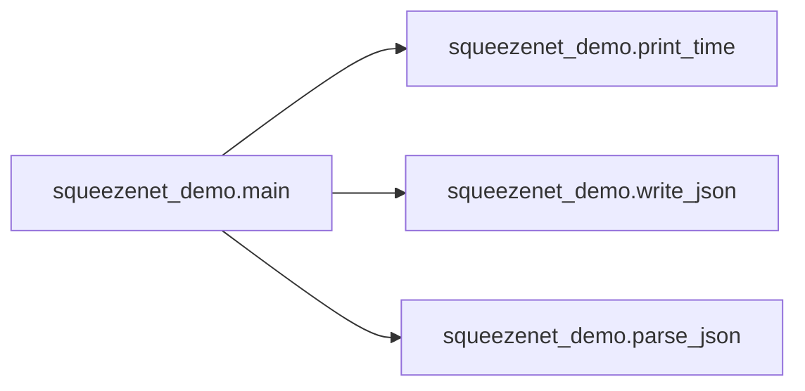

# Key Objects

[_Documentation generated by Documatic_](https://www.documatic.com)

<!---Documatic-section-model.SqueezeNet-start--->
## model.SqueezeNet

<!---Documatic-section-SqueezeNet-start--->
<!---Documatic-block-model.SqueezeNet-start--->
<details>
	<summary><code>model.SqueezeNet</code> code snippet</summary>

```python
def SqueezeNet(nb_classes, inputs=(3, 224, 224)):
    input_img = Input(shape=inputs)
    conv1 = Convolution2D(96, (7, 7), activation='relu', kernel_initializer='glorot_uniform', strides=(2, 2), padding='same', name='conv1', data_format='channels_first')(input_img)
    maxpool1 = MaxPooling2D(pool_size=(3, 3), strides=(2, 2), name='maxpool1', data_format='channels_first')(conv1)
    fire2_squeeze = Convolution2D(16, (1, 1), activation='relu', kernel_initializer='glorot_uniform', padding='same', name='fire2_squeeze', data_format='channels_first')(maxpool1)
    fire2_expand1 = Convolution2D(64, (1, 1), activation='relu', kernel_initializer='glorot_uniform', padding='same', name='fire2_expand1', data_format='channels_first')(fire2_squeeze)
    fire2_expand2 = Convolution2D(64, (3, 3), activation='relu', kernel_initializer='glorot_uniform', padding='same', name='fire2_expand2', data_format='channels_first')(fire2_squeeze)
    merge2 = Concatenate(axis=1)([fire2_expand1, fire2_expand2])
    fire3_squeeze = Convolution2D(16, (1, 1), activation='relu', kernel_initializer='glorot_uniform', padding='same', name='fire3_squeeze', data_format='channels_first')(merge2)
    fire3_expand1 = Convolution2D(64, (1, 1), activation='relu', kernel_initializer='glorot_uniform', padding='same', name='fire3_expand1', data_format='channels_first')(fire3_squeeze)
    fire3_expand2 = Convolution2D(64, (3, 3), activation='relu', kernel_initializer='glorot_uniform', padding='same', name='fire3_expand2', data_format='channels_first')(fire3_squeeze)
    merge3 = Concatenate(axis=1)([fire3_expand1, fire3_expand2])
    fire4_squeeze = Convolution2D(32, (1, 1), activation='relu', kernel_initializer='glorot_uniform', padding='same', name='fire4_squeeze', data_format='channels_first')(merge3)
    fire4_expand1 = Convolution2D(128, (1, 1), activation='relu', kernel_initializer='glorot_uniform', padding='same', name='fire4_expand1', data_format='channels_first')(fire4_squeeze)
    fire4_expand2 = Convolution2D(128, (3, 3), activation='relu', kernel_initializer='glorot_uniform', padding='same', name='fire4_expand2', data_format='channels_first')(fire4_squeeze)
    merge4 = Concatenate(axis=1)([fire4_expand1, fire4_expand2])
    maxpool4 = MaxPooling2D(pool_size=(3, 3), strides=(2, 2), name='maxpool4', data_format='channels_first')(merge4)
    fire5_squeeze = Convolution2D(32, (1, 1), activation='relu', kernel_initializer='glorot_uniform', padding='same', name='fire5_squeeze', data_format='channels_first')(maxpool4)
    fire5_expand1 = Convolution2D(128, (1, 1), activation='relu', kernel_initializer='glorot_uniform', padding='same', name='fire5_expand1', data_format='channels_first')(fire5_squeeze)
    fire5_expand2 = Convolution2D(128, (3, 3), activation='relu', kernel_initializer='glorot_uniform', padding='same', name='fire5_expand2', data_format='channels_first')(fire5_squeeze)
    merge5 = Concatenate(axis=1)([fire5_expand1, fire5_expand2])
    fire6_squeeze = Convolution2D(48, (1, 1), activation='relu', kernel_initializer='glorot_uniform', padding='same', name='fire6_squeeze', data_format='channels_first')(merge5)
    fire6_expand1 = Convolution2D(192, (1, 1), activation='relu', kernel_initializer='glorot_uniform', padding='same', name='fire6_expand1', data_format='channels_first')(fire6_squeeze)
    fire6_expand2 = Convolution2D(192, (3, 3), activation='relu', kernel_initializer='glorot_uniform', padding='same', name='fire6_expand2', data_format='channels_first')(fire6_squeeze)
    merge6 = Concatenate(axis=1)([fire6_expand1, fire6_expand2])
    fire7_squeeze = Convolution2D(48, (1, 1), activation='relu', kernel_initializer='glorot_uniform', padding='same', name='fire7_squeeze', data_format='channels_first')(merge6)
    fire7_expand1 = Convolution2D(192, (1, 1), activation='relu', kernel_initializer='glorot_uniform', padding='same', name='fire7_expand1', data_format='channels_first')(fire7_squeeze)
    fire7_expand2 = Convolution2D(192, (3, 3), activation='relu', kernel_initializer='glorot_uniform', padding='same', name='fire7_expand2', data_format='channels_first')(fire7_squeeze)
    merge7 = Concatenate(axis=1)([fire7_expand1, fire7_expand2])
    fire8_squeeze = Convolution2D(64, (1, 1), activation='relu', kernel_initializer='glorot_uniform', padding='same', name='fire8_squeeze', data_format='channels_first')(merge7)
    fire8_expand1 = Convolution2D(256, (1, 1), activation='relu', kernel_initializer='glorot_uniform', padding='same', name='fire8_expand1', data_format='channels_first')(fire8_squeeze)
    fire8_expand2 = Convolution2D(256, (3, 3), activation='relu', kernel_initializer='glorot_uniform', padding='same', name='fire8_expand2', data_format='channels_first')(fire8_squeeze)
    merge8 = Concatenate(axis=1)([fire8_expand1, fire8_expand2])
    maxpool8 = MaxPooling2D(pool_size=(3, 3), strides=(2, 2), name='maxpool8', data_format='channels_first')(merge8)
    fire9_squeeze = Convolution2D(64, (1, 1), activation='relu', kernel_initializer='glorot_uniform', padding='same', name='fire9_squeeze', data_format='channels_first')(maxpool8)
    fire9_expand1 = Convolution2D(256, (1, 1), activation='relu', kernel_initializer='glorot_uniform', padding='same', name='fire9_expand1', data_format='channels_first')(fire9_squeeze)
    fire9_expand2 = Convolution2D(256, (3, 3), activation='relu', kernel_initializer='glorot_uniform', padding='same', name='fire9_expand2', data_format='channels_first')(fire9_squeeze)
    merge9 = Concatenate(axis=1)([fire9_expand1, fire9_expand2])
    fire9_dropout = Dropout(0.5, name='fire9_dropout')(merge9)
    conv10 = Convolution2D(nb_classes, (1, 1), activation='relu', kernel_initializer='glorot_uniform', padding='valid', name='conv10', data_format='channels_first')(fire9_dropout)
    global_avgpool10 = GlobalAveragePooling2D(data_format='channels_first')(conv10)
    softmax = Activation('softmax', name='softmax')(global_avgpool10)
    return Model(inputs=input_img, outputs=softmax)
```
</details>
<!---Documatic-block-model.SqueezeNet-end--->
<!---Documatic-section-SqueezeNet-end--->

# #
<!---Documatic-section-model.SqueezeNet-end--->

<!---Documatic-section-squeezenet_demo.parse_json-start--->
## squeezenet_demo.parse_json

<!---Documatic-section-parse_json-start--->
<!---Documatic-block-squeezenet_demo.parse_json-start--->
<details>
	<summary><code>squeezenet_demo.parse_json</code> code snippet</summary>

```python
def parse_json(fname):
    with open(fname) as data_file:
        data = json.load(data_file)
    return data
```
</details>
<!---Documatic-block-squeezenet_demo.parse_json-end--->
<!---Documatic-section-parse_json-end--->

# #
<!---Documatic-section-squeezenet_demo.parse_json-end--->

<!---Documatic-section-squeezenet_demo.main-start--->
## squeezenet_demo.main

<!---Documatic-section-main-start--->


### Object Calls

* squeezenet_demo.print_time
* squeezenet_demo.write_json
* squeezenet_demo.parse_json

<!---Documatic-block-squeezenet_demo.main-start--->
<details>
	<summary><code>squeezenet_demo.main</code> code snippet</summary>

```python
def main():
    parser = argparse.ArgumentParser(description='SqueezeNet example.')
    parser.add_argument('--batch-size', type=int, default=32, dest='batchsize', help='Size of the mini batch. Default: 32.')
    parser.add_argument('--action', type=str, default='train', help='Action to be performed, train/predict')
    parser.add_argument('--epochs', type=int, default=20, help='Number of epochs, default 20.')
    parser.add_argument('--lr', type=float, default=0.001, help='Learning rate of SGD, default 0.001.')
    parser.add_argument('--epsilon', type=float, default=1e-08, help='Epsilon of Adam epsilon, default 1e-8.')
    parser.add_argument('-p', '--path', type=str, default='.', required=True, help='Path where the images are. Default: $PWD.')
    parser.add_argument('-v', '--val-path', type=str, default='.', dest='valpath', help='Path where the val images are. Default: $PWD.')
    parser.add_argument('--img-width', type=int, default=224, dest='width', help='Rows of the images, default: 224.')
    parser.add_argument('--img-height', type=int, default=224, dest='height', help='Columns of the images, default: 224.')
    parser.add_argument('--channels', type=int, default=3, help='Channels of the images, default: 3.')
    args = parser.parse_args()
    sgd = SGD(lr=args.lr, decay=0.0002, momentum=0.9)
    t0 = time.time()
    if args.action == 'train':
        train_generator = dp.train_data_generator(args.path, args.width, args.height)
        validation_generator = dp.val_data_generator(args.valpath, args.width, args.height)
        classes = train_generator.class_indices
        nb_train_samples = train_generator.samples
        nb_val_samples = validation_generator.samples
        print('[squeezenet_demo] N training samples: %i ' % nb_train_samples)
        print('[squeezenet_demo] N validation samples: %i ' % nb_val_samples)
        nb_class = train_generator.num_class
        print('[squeezenet_demo] Total classes are %i' % nb_class)
        t0 = print_time(t0, 'initialize data')
        model = km.SqueezeNet(nb_class, inputs=(args.channels, args.height, args.width))
        t0 = print_time(t0, 'build the model')
        model.compile(optimizer=sgd, loss='categorical_crossentropy', metrics=['accuracy'])
        t0 = print_time(t0, 'compile model')
        model.fit_generator(train_generator, samples_per_epoch=nb_train_samples, nb_epoch=args.epochs, validation_data=validation_generator, nb_val_samples=nb_val_samples)
        t0 = print_time(t0, 'train model')
        model.save_weights('./weights.h5', overwrite=True)
        model_parms = {'nb_class': nb_class, 'nb_train_samples': nb_train_samples, 'nb_val_samples': nb_val_samples, 'classes': classes, 'channels': args.channels, 'height': args.height, 'width': args.width}
        write_json(model_parms, fname='./model_parms.json')
        t0 = print_time(t0, 'save model')
    elif args.action == 'predict':
        _parms = parse_json('./model_parms.json')
        model = km.SqueezeNet(_parms['nb_class'], inputs=(_parms['channels'], _parms['height'], _parms['width']), weights_path='./weights.h5')
        dp.visualize_model(model)
        model.compile(optimizer=sgd, loss='categorical_crossentropy', metrics=['accuracy'])
        (X_test, Y_test, classes, F) = dp.prepare_data_test(args.path, args.width, args.height)
        t0 = print_time(t0, 'prepare data')
        outputs = []
        results = model.predict(X_test, batch_size=args.batchsize, verbose=1)
        classes = _parms['classes']
        for i in range(0, len(F)):
            _cls = results[i].argmax()
            max_prob = results[i][_cls]
            outputs.append({'input': F[i], 'max_probability': max_prob})
            cls = [key for key in classes if classes[key] == _cls][0]
            outputs[-1]['class'] = cls
            print('[squeezenet_demo] %s: %s (%.2f)' % (F[i], cls, max_prob))
        t0 = print_time(t0, 'predict')
```
</details>
<!---Documatic-block-squeezenet_demo.main-end--->
<!---Documatic-section-main-end--->

# #
<!---Documatic-section-squeezenet_demo.main-end--->

<!---Documatic-section-squeezenet_demo.print_time-start--->
## squeezenet_demo.print_time

<!---Documatic-section-print_time-start--->
<!---Documatic-block-squeezenet_demo.print_time-start--->
<details>
	<summary><code>squeezenet_demo.print_time</code> code snippet</summary>

```python
def print_time(t0, s):
    print('%.5f seconds to %s' % (time.time() - t0, s))
    return time.time()
```
</details>
<!---Documatic-block-squeezenet_demo.print_time-end--->
<!---Documatic-section-print_time-end--->

# #
<!---Documatic-section-squeezenet_demo.print_time-end--->

<!---Documatic-section-squeezenet_demo.write_json-start--->
## squeezenet_demo.write_json

<!---Documatic-section-write_json-start--->
<!---Documatic-block-squeezenet_demo.write_json-start--->
<details>
	<summary><code>squeezenet_demo.write_json</code> code snippet</summary>

```python
def write_json(data, fname='./output.json'):
    with open(fname, 'w') as fp:
        json.dump(data, fp, cls=NumpyAwareJSONEncoder)
```
</details>
<!---Documatic-block-squeezenet_demo.write_json-end--->
<!---Documatic-section-write_json-end--->

# #
<!---Documatic-section-squeezenet_demo.write_json-end--->

[_Documentation generated by Documatic_](https://www.documatic.com)